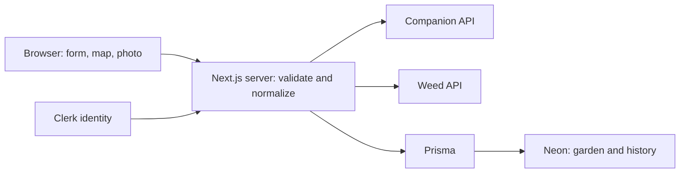

# Shamba AI — Technical Specification

Approved by the learner. This specification implements the approved scope and PRD, including signed receipts, garden revision guards, and the narrow reviewed guidance allowlist. Slices 1 and 2 are complete after verification and learner review; Slice 3 is implemented and mechanically verified, awaiting learner review.

## How This Works, In Plain Language

Shamba AI is one Next.js application. The browser handles the form, garden map, photo preparation, and display. Its server sends requests to the two RapidAPI services, checks their replies, and returns only the information the app can use honestly.

Visitors can generate a garden guide immediately. Clerk supplies identity when they save. Neon stores one garden per user and its confidently identified plants. Prisma handles the database reads and writes. Editing remains a separate draft until the user confirms saving; replacement updates the garden and clears its old history together.

Photos exist only temporarily in the browser and server request. A confident identification saves automatically. If that save fails, a short-lived server-signed receipt lets the browser retry saving the same trusted result without uploading the photo or paying for another identification request. A receipt is data with a signature the server can verify; it is not another service or database table.

The garden map is a **companion-placement guide**, not a capacity calculator. Provider rows supply relative placement; Shamba AI supplies the visual zones. Evidence labels distinguish strong provider conflicts from traditional or generated advisories.

## The Core Journey Through the System

Implements `prd.md > The Core Journey` and `States and Boundaries`.

1. Validate dimensions and crop choices in the browser and again on the server. Send one crop-list request; normalize the reply and display the draft map.
2. Keep the draft through Clerk sign-in. Load the user's saved garden; if one exists, preserve the draft and request replacement confirmation.
3. Save the normalized plan with a server-verified plan receipt. Initial saving creates a garden; confirmed replacement changes its revision and clears history in one transaction.
4. From that saved garden, prepare and preview one image locally. The server checks authentication, garden ownership/revision, and image limits before forwarding it.
5. Normalize the identification. Uncertain results do not save. Confident weeds and non-weeds save once against the original garden revision; results remain visible if saving fails.
6. Returning sign-in restores the stored plan and newest-first history. Opening details uses saved data and makes no provider request.



## Stack

| Choice | Role and documentation |
|---|---|
| Next.js App Router + TypeScript | One application for browser and server; [Route Handlers](https://nextjs.org/docs/app/getting-started/route-handlers) |
| CSS Modules + global CSS variables | Component styles and shared tokens; [Next.js CSS](https://nextjs.org/docs/app/getting-started/css). No Tailwind |
| Manrope through `next/font/google` | Shared readable typography; [font support](https://nextjs.org/docs/app/getting-started/fonts) |
| Motion for React | Restrained feedback; [installation](https://motion.dev/docs/react-installation) and [reduced motion](https://motion.dev/docs/react-motion-config) |
| Clerk | Sign up/in/out and server-side user identity; [Next.js quickstart](https://clerk.com/docs/nextjs/getting-started/quickstart) |
| Neon PostgreSQL | Persistent garden/history; [Neon Prisma guide](https://neon.com/docs/guides/prisma) |
| Prisma ORM | Schema, migrations, and queries; [Prisma 7 Next.js guide](https://www.prisma.io/docs/guides/v7/frameworks/nextjs) |
| Zod | Validate user input, receipts, normalized plans/results; [documentation](https://zod.dev/) |
| Vitest + React Testing Library | Focused service and client-component tests; [Vitest](https://vitest.dev/guide/), [RTL](https://testing-library.com/docs/react-testing-library/intro/), [Next.js test setup](https://nextjs.org/docs/app/guides/testing/vitest) |
| Vercel | Intended deployment host; [function limits](https://vercel.com/docs/functions/limitations) |

Planned compatibility baseline: Node.js 22.12+ or supported Node.js 24 (24.19.0 used for Slice 1), Next.js 16 with its matching React version, Prisma 7 packages at matching versions, Zod 4, and current compatible Clerk/Motion/test packages. Pin actual resolved versions in the lockfile during setup and verify installation/build before integration. Use Prisma's PostgreSQL adapter (`@prisma/adapter-pg` and `pg`), an explicitly generated client, and Node runtime handlers. No separate backend, queue, object storage, or additional AI service.

## Where It Runs and How Someone Tries It

The local Next.js process serves the browser and API. Clerk, Neon, and RapidAPI require network access. Configure ignored `.env.local`; `.env.example` contains placeholders only:

| Variable | Purpose |
|---|---|
| `NEXT_PUBLIC_CLERK_PUBLISHABLE_KEY` | Clerk's intentionally public browser key |
| `CLERK_SECRET_KEY` | Server authentication |
| `DATABASE_URL` | Neon pooled runtime connection |
| `DIRECT_URL` | Neon direct connection for migrations |
| `RAPIDAPI_KEY` | Existing shared key for the two subscribed services |
| `APP_SIGNING_SECRET` | Random server-only secret for approved receipts |

Prisma configuration explicitly loads `.env.local` for local CLI use, retaining externally supplied deployment variables. The runtime adapter uses `DATABASE_URL`; migrations use `DIRECT_URL`. No secrets use a `NEXT_PUBLIC_` prefix. Server modules import `server-only`; logs exclude keys, photos, receipts, and raw provider bodies.

Planned scripts make startup repeatable after scaffolding:

```text
npm install
npm run db:generate             # prisma generate
npm run db:deploy               # prisma migrate deploy: apply committed migrations
npm run dev                    # next dev; open http://localhost:3000
```

During schema development only, `npm run db:migrate` runs `prisma migrate dev` against the development database. `npm test` runs Vitest; `npm run lint`, `npm run typecheck`, and `npm run build` verify the app. Build generates Prisma Client before `next build`. Never run tests that clear data against the application's saved-garden database.

For Vercel: import the developer's repository, configure the same environment variables and Clerk application URLs, apply committed migrations separately with `db:deploy`, then build/deploy. Use Node runtime, Fluid Compute, and `maxDuration: 120` for analysis handlers; the planned upstream timeout is 90 seconds. Vercel documents a 4.5 MB request/response payload limit and a 300-second Hobby Fluid Compute duration limit; verify actual project settings before the demo. These are hosting limits, not provider latency promises.

Record the complete journey locally or on Vercel. Submission still requires a short demo video and public GitHub repository; deployment is optional. No deployment occurs during planning.

## Look and Feel

Implements `prd.md > Look and Feel` and `Responsive Layout and Motion`.

Global tokens: forest `#1F4D3A`, leaf `#6F9E55`, cream `#F7F5EE`, soil `#8A6746`, text `#202A25`, muted green-gray borders, accessible amber/red states. Check text contrast rather than assuming every palette pairing is accessible. Manrope uses `next/font`; components use CSS Modules. Rounded, spacious controls; simple local crop icons and explicit labels; the map is the visual focus.

Mobile-first layout: stack dimensions where needed, wrap crop cards, maintain map width:length proportions, adapt action groups, and use at least 44px touch targets. Long names wrap. A labeled crop legend accompanies compact map labels. Use selected `aria-pressed` states, associated inline errors, visible keyboard focus, announced loading/results, and a focus-managed replacement dialog.

Motion uses short opacity/transform transitions around 150–250ms with no action delay. `MotionConfig reducedMotion="user"`, a reduced-motion hook, and CSS media rules remove unnecessary movement. Loading also has text; no essential status depends on animation.

## Components

### Garden Workspace

Implements `prd.md > Authentication and Garden Saving`, `Save After Signing In to an Existing Garden`, and `States and Boundaries`.

One main surface at `/` switches among form, draft, saved garden, upload, and detail views. React state keeps saved data separate from editing data. A bounded, versioned `sessionStorage` entry holds only draft inputs, normalized plan/receipt, and pending-save intent across same-tab authentication redirects. It contains no photo or saved history. If storage is unavailable, explain that the draft cannot survive a redirect before leaving the page; do not silently lose it.

Normal sign-in loads My Garden; pending Save resumes the draft and checks for an existing garden first. Cancel editing discards that edit draft and returns to the saved view. Clear saved data, pending operations, and photo URLs on sign-out/account change; ignore late responses from the previous session. Public unsaved drafts can remain while navigating sign-in, but authenticated drafts are owner-tagged to prevent cross-account reuse.

### Garden Form

Implements `prd.md > Garden Planning Form` and `Input Validation`.

Width/length each finite numbers 1–5 inclusive; allow decimals with `step="any"`. Reject blank/non-finite values. Crop IDs are `tomato`, `carrot`, `onion`, `basil`, unique with count 2–4. Preserve invalid input for correction. Disable duplicate generation while processing; failures leave inputs intact.

### Garden Map and Plan Preview

Implements `prd.md > Companion-Planting Layout` and `Companion Conflict Evidence`.

Normalize crop names case-insensitively using the four explicit aliases. Validate every row's crop membership and complete coverage of the selection. Repeated crop zones are allowed. Reject a result with missing selected crops, unknown additions, or no usable rows rather than manufacturing a successful plan.

Store versioned normalized rows with stable IDs, selected crop IDs, and relative order. Render illustrative equal-height row bands and labeled zones within them; preserve the overall rectangular proportions. Compass labels become neutral row positions. Do not display generated quantities, stages, exact spacing, location/sun assumptions, or claim planting capacity. Explanations use pair guidance with its qualifications; omit contextual prose that cannot be presented without unsupported environmental assumptions. No capacity rejection is implemented without reliable capacity data.

Normalize unordered pairs and deduplicate with precedence: strong structured conflict, traditional structured conflict, generated negative advisory, positive companion guidance. Unknown evidence values never become strong warnings. Conflicting positive prose is omitted when stronger conflict guidance applies. UI labels: **Provider code-checked conflict**, **Companion advisory**, and supported companion notes; never provider field names. The first label is attributed to the provider, not an independent verification claim. Extreme landscape and portrait beds (width:length >=3:1 or <=1:3) use compact numbered crop zones with a named/icon crop key to preserve proportions without clipping names; each zone retains its accessible crop name.

Strong conflicts have a distinct calm ochre outline and filled evidence badge; softer advisories retain amber styling. Labels and wording remain the primary evidence distinction. Advisories use the approved cautious wording even when raw provider prose sounds categorical. Any retained rationale is explicitly attributed to the provider and must not reintroduce a proven-incompatibility or mandatory-separation claim.

Preserve row ordering where possible; split/rearrange zones to avoid placing strong conflicting crops in the same or touching zones. Attempt advisory separation without overriding stronger warnings. With at most four crops, consider at most 24 distinct crop orderings within a small fixed set of map templates, using stable tie-breaking. Do not add an optimization service, open-ended search, or a general layout engine. If strong separation cannot be represented cleanly within those templates, show the affected pair warning and **We could not create a clear layout that separates these crops.** Preserve the inputs so the user can change selections; do not present a conflicting map as a successful guide. Do not invent separation distances. Persist the final rendered rows and evidence, so restoration does not recompute a different layout.

### Authentication and Replacement Dialog

Implements `prd.md > Authentication and Garden Saving` and `Changing and Replacing a Garden`.

Clerk prebuilt sign-in/sign-up pages and a simple sign-out control provide only approved account functions. Clerk middleware in `src/proxy.ts` supplies authentication; public planning remains public. Every data handler obtains server `userId` and checks ownership rather than trusting a browser-supplied user identifier.

Saving checks the current garden revision. Existing gardens always require the approved replacement confirmation. In a short database transaction, compare that revision, replace the plan, delete old history, and increment the revision together. Use serializable isolation with bounded database-conflict retries; no provider calls inside the transaction. A stale revision returns a conflict and preserves the draft for review. A repeated save of the same plan ID returns the prior saved result without clearing history again. [Prisma transactions](https://www.prisma.io/docs/orm/v7/prisma-client/queries/transactions) provide the transaction/isolation mechanisms.

### My Garden and Identification History

Implements `prd.md > My Garden`, `Historical Result`, and `Garden History and Restoration`.

Load the saved normalized plan without regenerating it. Load history separately so its failure does not hide the map; distinguish empty/loading/error. Sort by app `identifiedAt` descending, with ID as a stable tie-breaker. Detail reads enforce ownership and show classification, names, provider score, saved explanation/guidance, and time, without a photo. Display UTC timestamps in the browser's locale/time zone; do not use cached provider timestamps as the identification date.

### Photo Preparation and Upload

Implements `prd.md > Photo Identification`.

Accept only JPEG/PNG/WEBP. Files at or below **3,000,000 bytes** remain unchanged after usability checks. For larger files, decode locally with orientation honored, preserve aspect ratio, and never crop/upscale. Bounded compression: cap the long edge at 2048px, try JPEG qualities 0.90, 0.82, 0.74, then 1600px and 1280px at 0.82 if needed, never increasing dimensions between attempts. Flatten transparency onto a light background for JPEG export. Stop at the first usable file within the cap; otherwise ask for a smaller/clearer photo. These settings preserve useful detail but require real phone-photo testing; they are not an accuracy guarantee.

Use native decoding/canvas APIs, checking export MIME, null failures, and actual size ([Canvas export](https://developer.mozilla.org/en-US/docs/Web/API/HTMLCanvasElement/toBlob)). Preview and submit the same prepared File. Release decoded resources and object URLs on replacement/exit; prevent older processing jobs from replacing a newly selected image.

The server accepts one multipart image plus small garden/revision/request-ID fields. Enforce total body bounds, image size, nonempty content, supported MIME, and matching JPEG/PNG/WEBP magic bytes before forwarding. Magic bytes are format checks, not proof the entire file is valid. Reject invalid requests without a provider call. Vercel may reject oversized bodies before the handler; browser error handling covers that response too. No uploaded filename is used as a filesystem path and no image is written permanently.

### Identification Normalizer and Result Card

Implements `prd.md > Identification Confidence Policy`, `Confident Non-Weed Results`, and `Small-Garden Control Guidance`.

Parse a successful envelope separately from identification confidence. Require an actual boolean `result.isWeed`, finite numeric `result.confidence` from 0–100 and at least 90, and a trimmed common or scientific name that is not a placeholder such as unknown/unidentified/N/A. Do not coerce strings or substitute `overallConfidence`.

Usable explanatory evidence means at least one nonempty, non-placeholder botanical identification feature, or a usable plant characteristic such as family, plant type, or lifecycle. Names, scores, and the classification alone do not satisfy this condition. Build a short explanation from up to two supplied features, or supplied botanical characteristics if features are absent; use plain escaped text and bounded field lengths. Exclude control, edibility, medical, toxicity, and regulatory claims from this explanation. If evidence cannot support that text, return uncertainty rather than fabricate content.

Return a discriminated outcome: `uncertain` or `identified`. Identified data includes classification `weed | not_weed`, optional common/scientific names with display-name fallback, score, explanation, filtered guidance, garden ID/revision, request ID, and app UTC time. Provider/transport errors remain retryable failures. Display **Provider confidence: N/100**; 90 is the conservative application threshold, not calibrated accuracy.

For non-weeds, guidance is always empty and UI shows the approved no-weed-control message. For weeds, use a deliberately narrow whole-item allowlist for reviewed small-garden advice. Initially allow only the two reviewed live sentences about hand-digging the taproot and applying mulch in garden beds, after whitespace/case normalization. Store/display the original accepted sentence. These entries are approved for display only when returned by the provider; never add them to other results as generic advice. All other advice is omitted. Do not expand this allowlist during implementation to increase guidance coverage. Any future expansion requires explicit review and agreement; use the approved fallback whenever no reviewed advice survives. This conservative policy may hide useful guidance for other plants, while leaving arbitrary-photo identification fully supported.

Approved allowlist entries, taken from the sanitized dandelion fixture:

- “Hand-dig or fork out the entire taproot, especially after rain when soil is soft.”
- “Apply mulch in garden beds to suppress seedling establishment.”

Do not pass through a category wholesale or allow a sentence merely because it contains “hand” or “mulch.” Ignore chemical, organic-approved, biological, resistance, and field/lawn-management content. Non-matching or mixed-method advice is excluded. If no guidance survives, show **No suitable control guidance was provided for this small food garden.** Store only filtered advice and apply the same allowlist on historical reads. This is a bounded presentation policy, not a general agronomic safety classifier.

### Identification Saving and Retry

Implements `prd.md > Photo Identification` and `Garden History and Restoration`.

Capture user identity, garden ID/revision, and a browser-generated UUID request ID before analysis. Verify ownership and revision before spending quota and again in the save transaction. If a saved duplicate exists, return it. Concurrent replacement prevents saving the old result into the new revision; show the result as unsaved with an explanation that the garden changed. Expired authentication asks for sign-in before save retry.

After confident normalization, create a signed result receipt bound to user, garden/revision, request ID, normalized result, and expiry; then attempt persistence. Database failure returns the result with `saveState: failed` and the receipt. Retry verifies signature, expiry, schema, identity, revision, confidence/evidence, and guidance policy, then inserts idempotently without calling RapidAPI. A unique request ID prevents duplicate saved entries, including ambiguous network failures. Repeated simultaneous requests can still spend extra provider quota before either saves; the client prevents duplicate submissions and no exactly-once upstream guarantee is claimed.

Receipts use HMAC-SHA256 with Node crypto, purpose tags, constant-time verification, and a 24-hour expiry. Plan receipts contain normalized plan, original inputs, and plan ID; result receipts also retain the minimal evidence needed to revalidate confidence. Keep result receipts in memory during save retry; no photo, key, or raw provider response is included. Expired receipts cannot save: retain visible information and explain that a new analysis/plan is needed. This tradeoff avoids an extra pending-results table or storage service.

## Data Model

Implements `prd.md > Authentication and Garden Saving`, `Changing and Replacing a Garden`, and `Garden History and Restoration`.

| Model | Fields and constraints |
|---|---|
| `Garden` | UUID `id`; unique `clerkUserId`; numeric `widthM`, `lengthM`; selected `CropId[]`; versioned normalized `plan` JSON (rows and evidence); `planId`; integer `revision`; `createdAt`, `updatedAt` |
| `Identification` | UUID `id`; `gardenId` foreign key with cascade delete; `gardenRevision`; unique UUID `requestId`; enum `classification`; nullable `commonName` and `scientificName` (at least one required by app validation); numeric `confidence`; `explanation`; filtered `guidance` JSON array; UTC `identifiedAt` |

All current saved identifications necessarily have a valid score >=90. Optional provider names remain optional; no fake common name is stored. Index history on garden/time. No local User model, profile data, image table, raw provider response, or multiple-garden relation is needed. Validate versioned JSON before UI use; an unreadable stored plan produces a restoration error, not a silently generated replacement.

Browser state contains raw form values, a separate normalized draft/receipt, current saved data, and the current prepared photo/result. Only the draft survives same-tab navigation via sessionStorage. Database records survive returning sessions; browser caches never substitute for ownership checks.

## Application Route Contracts

All authenticated handlers return JSON `401` for absent identity and verify record ownership; inaccessible record IDs do not disclose another user's data. Mutation handlers accept only same-origin requests. Responses use stable error codes/messages, never raw upstream errors.

| Route | Input and output |
|---|---|
| `POST /api/plans` | Public JSON dimensions/crop IDs → normalized draft and signed plan receipt; no DB mutation |
| `GET /api/garden` | Authenticated → saved garden or `garden: null`; retrieval failure is distinct |
| `PUT /api/garden` | Plan receipt, expected revision (null for first save), replacement confirmation → saved garden; stale/unconfirmed replacement returns `409` |
| `GET /api/garden/history` | Authenticated → newest-first saved results |
| `POST /api/identifications` | Authenticated multipart image, garden ID/revision, request ID → uncertain, or identified with saved/failed state and retry receipt if needed |
| `POST /api/identifications/retry` | Authenticated signed result receipt → saved identification; no API call |
| `GET /api/identifications/[id]` | Authenticated → owned historical result |

Validation errors use `400`, oversize `413`, unsupported media `415`, stale garden `409`, provider throttling `429`, and provider/timeout errors `502`/`504`. A successful identification with failed DB saving remains a successful analysis response with explicit `saveState: failed`; it must not be rendered as analysis failure.

## External Services and Dependencies

### Companion Planting API

Source: [RapidAPI listing](https://rapidapi.com/bilgisamapi-api6-bilgisam/api/companion-planting-api-ai-garden-planner-layout/playground/serviceInfo); exact evidence and quotas in [api-verification.md](api-verification.md).

Call `POST https://companion-planting-api-ai-garden-planner-layout.p.rapidapi.com/analyze`, JSON `{ plants: "tomato,carrot,onion,basil", bedWidthM: "3", bedLengthM: "4", language: "en" }`. Use selected IDs and stringified validated dimensions, including decimals, as live-tested. Headers: `X-RapidAPI-Key`, `X-RapidAPI-Host`, JSON content type. Do not send invented sun/climate/country context.

Read the successful envelope and `result.plants`, `goodPairs`, `badPairs`, `knownConflicts`, `layout.rows`. Rows have plants/position/why/spacing; there are no coordinates, row widths, or reliable capacity flag. Retain only selected crop mapping, illustrative rows, useful qualified companion guidance, and evidence. Raw payloads never reach components or persistence. Observed successful latency: 17.58–20.37s for two calls; BASIC lists 50 requests/month, free hard limit, last observed 47 remaining.

### Weed Identification API

Source: [RapidAPI listing](https://rapidapi.com/bilgisamapi-api6-bilgisam/api/weed-identification-api-ai-weed-detection-control/playground); exact evidence in [api-verification.md](api-verification.md).

Call `POST https://weed-identification-api-ai-weed-detection-control.p.rapidapi.com/analyze`, multipart `image`, `language=en`, `system=garden`, with the two RapidAPI headers. Let FormData set its boundary. Do not supply a fictitious single crop, country, or growth stage. This route was verified with uploaded JPEGs and both weed/non-weed outcomes; PNG/WEBP are documented but not live-tested.

Read `result.weed.commonName/scientificName` and botanical fields, `result.isWeed`, `result.confidence`, `result.identificationFeatures`, and narrowly allowed control entries. No standalone explanation is provided. Ignore `overallConfidence` as an identification-score fallback. Use app time. Observed successful latency: 11.87–19.76s; BASIC lists 30 requests/month, free hard limit, last observed 28 remaining. Counts are account snapshots, not future balances.

Both services document `GET /` service information and GET/POST `/analyze`; the app uses only POST analysis. Every endpoint request counts against quota. No automatic upstream retries or speculative requests. Disable duplicate UI submission. Public unauthenticated generation can consume the shared quota; this PoC does not claim durable public abuse prevention. Hosting access/rate protections can be configured for a public demo without adding an application service. Do not promise an enforced 250/minute provider rate: the public metadata's limit was disabled.

### Clerk, Neon, and Hosting

Use Clerk's public browser key and secret server key; use Neon connection strings exclusively server-side. Provisioning and account-specific plan limits are not yet verified. Intended free-tier development does not authorize paid upgrades. Use the official links in Stack for setup and recheck account usage before deployment. No external service is called from a transaction, and no browser call contains the RapidAPI key.

## Focused Verification

| Area | Required evidence |
|---|---|
| Input and companion normalization | 1/5 boundaries, decimals, blank/non-finite values, unique 2–4 crop selection; both sanitized live fixtures; missing/extra crops; repeated rows; strong/traditional/generated precedence; no unsupported counts/orientation/capacity claims |
| Identification normalization | Live dandelion/basil fixtures; exactly 90 passes with evidence; below/missing/string/out-of-range/non-finite score fails; invalid names/boolean/evidence fail; no overallConfidence rescue; non-weeds never show controls |
| Guidance and results | Only reviewed complete advice survives; mixed/unknown/excluded advice hidden; non-weed message; confidence score wording; uncertainty excluded; save failure retains result and retry adds once |
| Garden persistence | Ownership checks, stale revision rejection, canceled edit/confirmation unchanged, rollback preserves old history, confirmed replacement clears it, duplicate save preserves new history, in-flight identification cannot attach to replacement |
| Photo and client behavior | <=3 MB unchanged, processed preview equals upload, finite compression attempts, decoding/export failure, server rejects oversized/invalid format; pending draft survives sign-in; sign-out clears private data; accessible result/dialog states |

Vitest exercises pure schemas/normalizers/services with sanitized fixtures from `devpost/api-checks`. Simulated uncertainty, strong conflicts, errors, and DB failures are labeled simulated, not new provider evidence. RTL tests interactive client behavior; async server components are covered through services and manual journey checks rather than unsupported component tests.

Verify transactional replacement/idempotency against a disposable test PostgreSQL database using `TEST_DATABASE_URL`, guarded to differ from runtime/migration databases. Do not treat mocked transaction calls as proof of database atomicity. Manually verify the full Clerk journey, account isolation, phone-photo preparation, mobile/tablet/desktop layouts, and reduced motion. Run live requests only when a new integration question justifies quota use; normal tests never consume RapidAPI quota.

## File Structure

Planned files; generated dependency contents omitted. Paired `.module.css` files style their named component only.

```text
shamba-ai/
├── src/
│   ├── app/
│   │   ├── layout.tsx                         # Clerk, Manrope, motion provider
│   │   ├── page.tsx                           # Main workspace entry
│   │   ├── globals.css                        # Tokens, resets, accessibility
│   │   ├── sign-in/[[...sign-in]]/page.tsx      # Clerk sign-in
│   │   ├── sign-up/[[...sign-up]]/page.tsx      # Clerk sign-up
│   │   └── api/
│   │       ├── plans/route.ts                 # Public companion analysis
│   │       ├── garden/route.ts                # Read/save/replace one garden
│   │       ├── garden/history/route.ts        # Owned history
│   │       ├── identifications/route.ts       # Temporary photo analysis/save
│   │       ├── identifications/retry/route.ts # Save-only retry
│   │       └── identifications/[id]/route.ts  # Owned historical details
│   ├── components/
│   │   ├── GardenWorkspace.tsx + .module.css  # Draft/saved/auth orchestration
│   │   ├── PlantIcon.tsx                      # Shared local vector crop icons
│   │   ├── GardenForm.tsx + .module.css       # Dimensions and crop selection
│   │   ├── GardenMap.tsx + .module.css        # Proportional labeled guide
│   │   ├── GardenPlan.tsx + .module.css       # Summary/explanations/actions
│   │   ├── MyGarden.tsx                       # Saved plan and history cards
│   │   ├── ReplaceGardenDialog.tsx + .module.css # Destructive confirmation
│   │   ├── PlantUpload.tsx + .module.css      # Preparation/preview/analysis
│   │   ├── IdentificationResult.tsx           # Current/history result, shared upload styles
│   │   ├── HistoricalResult.tsx               # Owned detail retrieval states
│   │   └── MotionProvider.tsx                # Reduced-motion defaults
│   ├── lib/
│   │   ├── types.ts                          # Normalized domain contracts
│   │   ├── schemas.ts                        # Zod input and output checks
│   │   ├── crops.ts                          # Four IDs, names, icons
│   │   ├── guidance.ts                       # Shared reviewed whole-item allowlist
│   │   ├── client/draft.ts                   # Same-tab draft preservation
│   │   ├── client/image.ts                   # Bounded native compression
│   │   └── server/
│   │       ├── env.ts                        # Server configuration checks
│   │       ├── prisma.ts                     # Shared PostgreSQL adapter/client
│   │       ├── rapidapi.ts                   # Hosts, fetch, timeout/errors
│   │       ├── companion.ts                  # Rows/evidence normalization
│   │       ├── identification.ts             # Confidence/evidence policy
│   │       ├── upload.ts                     # Bounded multipart and image validation
│   │       ├── receipts.ts                   # Signed plan/result receipts
│   │       ├── gardens.ts                    # Transactional replacement
│   │       └── history.ts                    # Owned idempotent result saves
│   ├── generated/prisma/                    # Generated and ignored
│   └── proxy.ts                              # Clerk middleware, public planning
├── prisma/
│   ├── schema.prisma                         # Two models and classification enum
│   └── migrations/<initial>/migration.sql    # Committed schema migration
├── tests/
│   ├── setup.ts                              # RTL setup and explicit test mocks
│   ├── validation.test.ts                    # Input boundaries
│   ├── receipts.test.ts                      # Receipt integrity/expiry
│   ├── plans-route.test.ts                   # Validated server/provider boundary
│   ├── companion.test.ts                     # Coverage and evidence
│   ├── identification.test.ts                # Confidence/guidance/non-weeds
│   ├── garden.integration.test.ts            # Disposable DB replacement/retry
│   ├── image.test.ts                         # Preparation contracts
│   └── workspace.test.tsx                    # Draft/auth/result interactions
├── devpost/                                  # Approved planning + API evidence
├── prisma.config.ts                          # CLI config and local env loading
├── vitest.config.ts                          # Unit/RTL and guarded DB tests
├── next.config.ts                            # Next configuration
├── next-env.d.ts                             # Generated Next types
├── tsconfig.json                             # Strict types, src alias
├── eslint.config.mjs                         # Lint configuration
├── package.json + package-lock.json          # Scripts, pinned dependencies
├── .env.example                              # Placeholders only
├── .gitignore                                # Secrets/generated/local artifacts
├── README.md                                 # Startup, demo, limitations
├── AGENTS.md                                 # Manual Git workflow instructions
└── git.md                                    # Ignored local rules
```

## Important Failure Modes

- **Slow, malformed, or quota-blocked provider response:** keep inputs/photo usable, show progress then a clear retry/error; no silent sample-data substitution or automatic billable retry. A malformed identification's missing decision fields produce uncertainty only when the provider analysis itself succeeded.
- **Authentication, restoration, or database failure:** distinguish absent garden/history from a failed read. Retain drafts and confident unsaved results. Replacement rolls back as a whole; save-only retry verifies the original garden revision.
- **Photo cannot be processed/uploaded:** give format/size/photo tips and allow replacement; never forward oversized originals or permanently retain images.

## What Was Simplified and Why

One Next.js application, two database models, one saved garden, native bounded photo preparation, result-only history, and deterministic evidence policies keep the architecture within the approved journey. No permanent images, capacity estimates, geolocation, admin/profile functions, separate AI explanation service, or background processing. The real provider integrations remain the kernel; simulated test cases are never shown as live results.

## Decisions and Open Issues

- **Learner choices:** the stack, one-garden persistence, visitor-first planning, confidence threshold, non-weed history, excluded controls, bounded browser preparation, and conflict evidence policy are explicitly agreed.
- **Learning uncertainty resolved:** the learner asked what the APIs actually supply. Public contracts plus four live checks established row/pair guidance, no reliable capacity model, two classification outcomes, and unsafe contextual control content. Provider accuracy, score calibration, and uncertain/failure response shapes remain unverified; tests simulate those branches honestly.
- **Approved implementation choices:** signed receipts and their extra local secret/expiry, revision-based transactions, bounded compression settings, and the two-sentence guidance allowlist. Do not expand the allowlist during implementation. The map uses bounded deterministic arrangements; an unrepresentable strong conflict produces a clear warning rather than additional engine complexity.
- **Build checks still needed:** package compatibility, Clerk/Neon provisioning, test database configuration, actual Vercel limits/settings, browser photo detail/readability, and the deterministic map's treatment of simulated strong conflicts. They are verification work, not invitations to add product features.
- **Readiness:** every PRD behavior has a component and data flow. Authentication, safe replacement, and retry add meaningful work beyond a basic API demo, but the design avoids additional services and stores only the approved data. Technical planning is approved. The next stage is review of the ordered build slices in `checklist.md`, then implementation after that build order is approved.

### Approved modal authentication and global loading refinement

Use Clerk’s `openSignIn` with sign-up enabled for in-app authentication actions, preserving the draft before opening. Keep direct auth routes for callbacks and return to the workspace after completion. A layout-level GlobalLoadingProvider tracks independently owned operation tokens; usePageLoading registers active component operations and removes them on completion/unmount. The shared accessible loading indicator is non-blocking and respects reduced motion. App Router loading.tsx reuses the indicator for route suspension.
